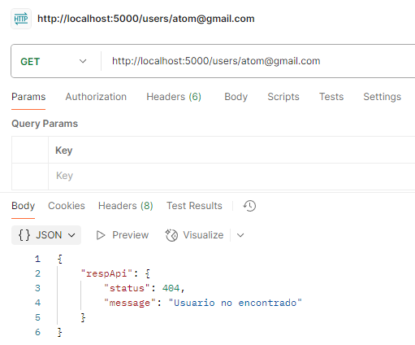
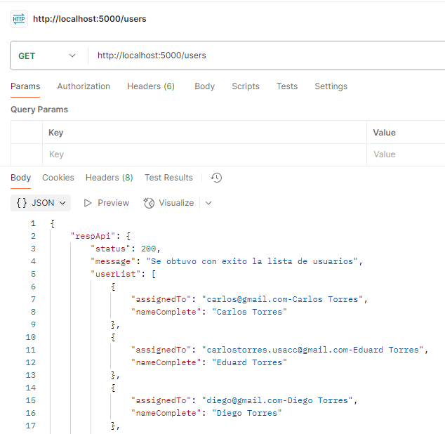
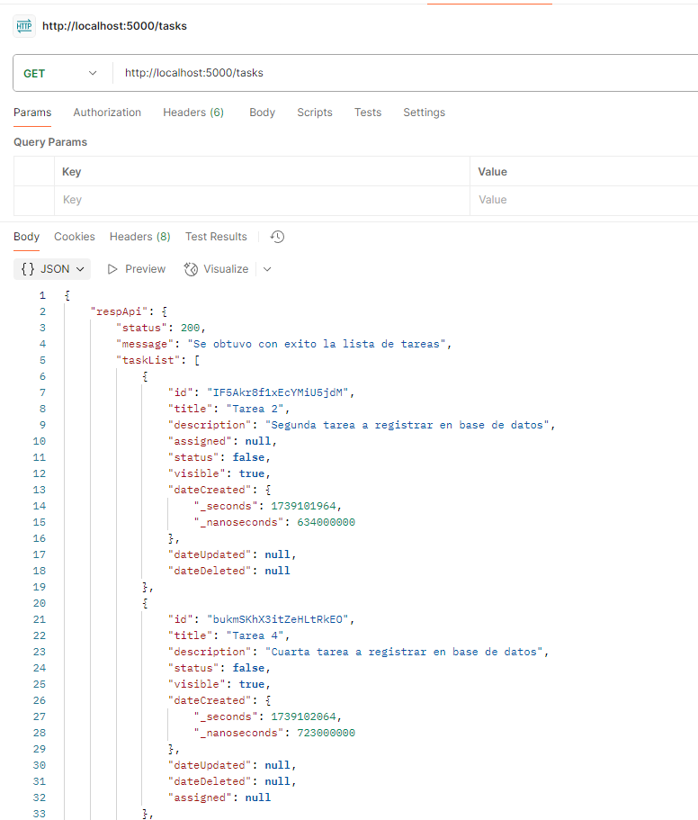
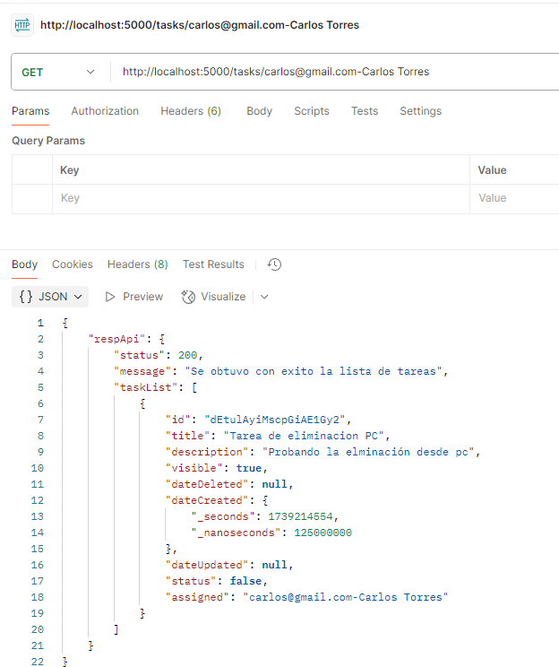
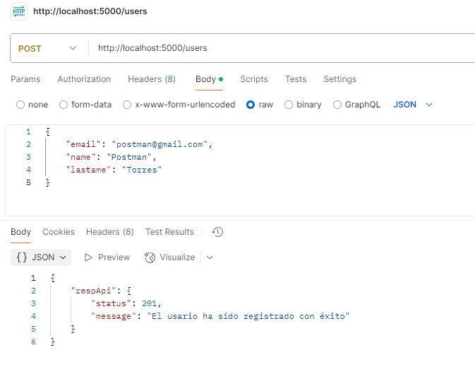
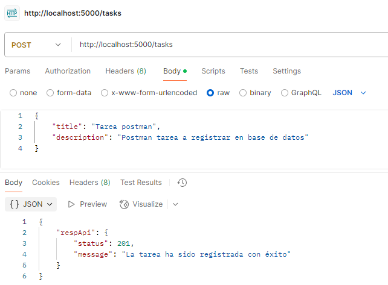
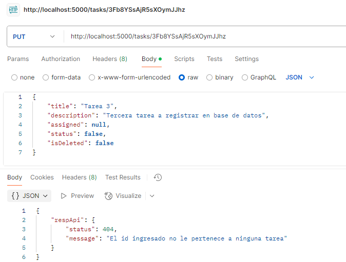
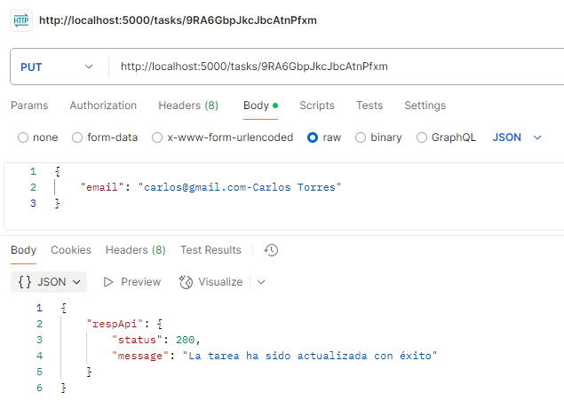
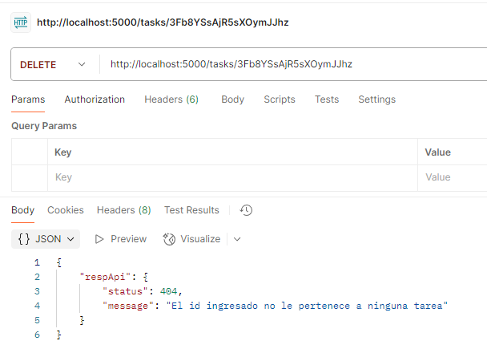

# A continuación se detalla la descripción y funcionamiento de cada endpoint realizado

- # METODOS GET
  - ## **urlserver/users/{email}**
    Atraves de este método se puede validar si el correo ingresado existe o no en la base de datos, ejemplo de la solicitud:
    
    
    
  - ## **urlserver/users**
    Atraves de este método se puede obtener la lista completa de usuarios, ejemplo de la solicitud:
    
    
    
  - ## **urlserver/tasks**
    Atraves de este método se puede obtener la lista completa de tareas, ejemplo de la solicitud:
    
    
    
  - ## **urlserver/tasks/{assignedTo}**
    Atraves de este método se puede obtener la lista completa de tareas asignadas a cada usuario, ejemplo de la solicitud:
    
    
    
- # METODOS POST
  - ## **urlserver/users**
    Atraves de este método se puede registrar un nuevo usuario si no existe en la base de datos, ejemplo de la solicitud:
    
    
    
  - ## **urlserver/tasks**
    Atraves de este método se puede registrar una nueva tarea si no existe en la base de datos, ejemplo de la solicitud:
    
    
    
- # METODOS PUT
  - ## **urlserver/tasks/{taskId}**
    Atraves de este método se puede actualizar la información de una tarea, puede ser el título, descripción y su estado, ejemplo de la solicitud:
    
    
    
  - ## **urlserver/tasks/assigned/{taskId}**
    Atraves de este método se puede asignar una tarea a un usario en especifico, ejemplo de la solicitud:
    
    
    
- # METODOS DELETE
  - ## **urlserver/tasks/{taskId}**
    Atraves de este método se puede eliminar, ejemplo de la solicitud:
    
    

