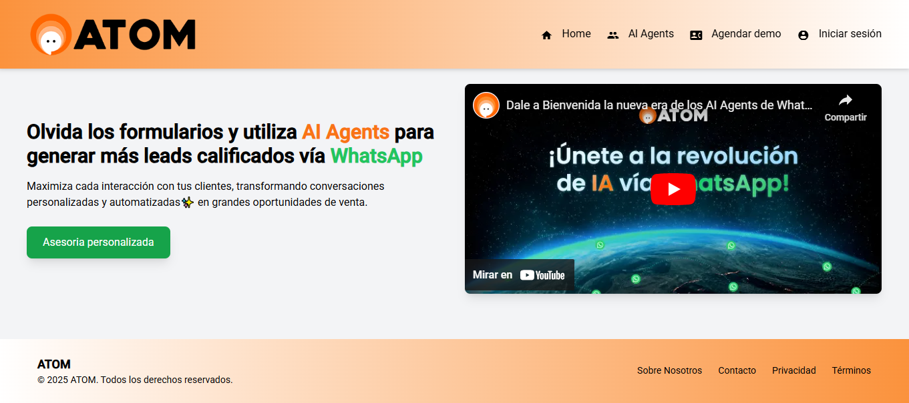
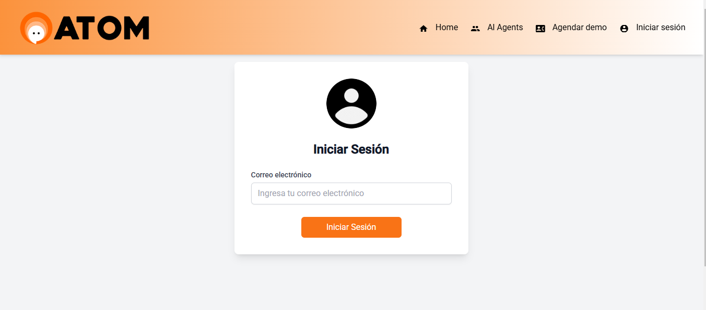
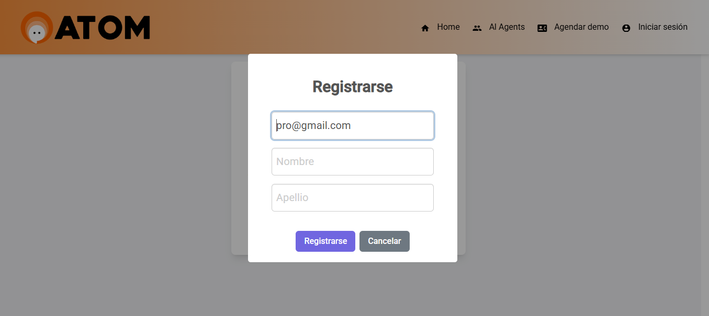
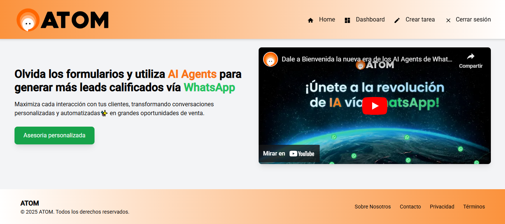
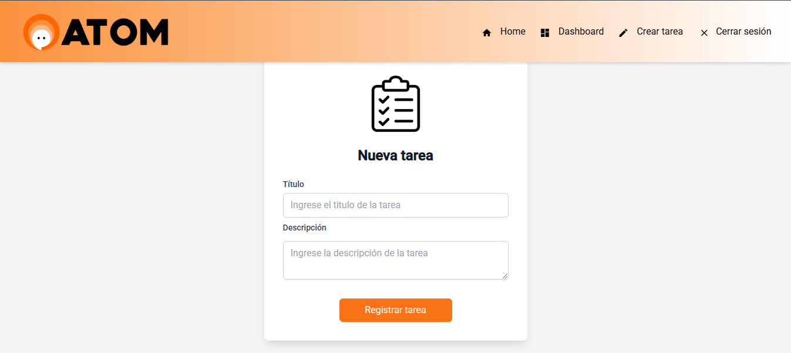
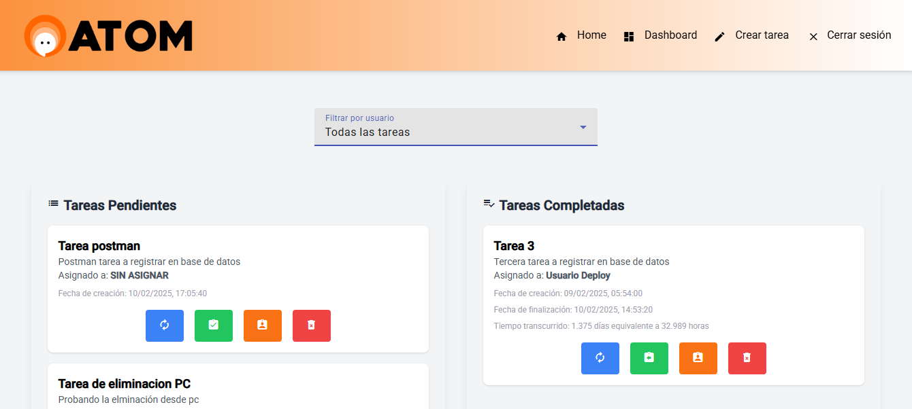

# A continuación se detalla brevemente el funcionamiento de cada módulo de la web app

- # Página principal
  En esta página principal es la primera que un usuario cómun puede acceder, en esta se puede visualizar información general sobre **Atom** y los servicios que ofrece.
      
  

- # Iniciar sesión
  En esta página se visualiza un formulario con la información necesaria para poder iniciar sesión y acceder a todos los servicios, **(Cabe resaltar que si el usuario no existe se le muestra una advertencia y se procede a solicitar la información para el registro del usuario)**
      
  

- # Registrarse
  En esta página o módulo se visualiza cuando se intento iniciar sesión pero no se tuvo éxito por lo cual se solicita información para registrarse
  
  

- # Página principal de usuario
  En esta página se muestra toda la información de **Atom** y módulos personalizados que solo se tienen al iniciar sesión. 
  
  

- # Crear tarea
  En esta página se muestra toda la información necesaria para poder crear una nueva tarea. 
  
  

- # Dashboard
  En esta página se puede observar el dahsboard de la información de todas las tareas **Pendiente** y **Completadas**, en esta página se tienen varias funciones tales como:
    - **Filtrar por usuario** : Esta opción permite filtrar la lista de tareas por los usuarios de Atom.
    - **Actualizar tarea** : Esta opción permite modificar la información de una tarea en especifico.
    - **Completar tarea** : Esta opción permite modificar el estado de la tarea de **PENDIENTE a COMPLETADA**
    - **Asignar tarea** : Esta opción permite asignar a un usuario una tarea en especifico.
    - **Eliminar tarea** : Esta opción permite eliminar una tarea del dashboard. 
  
  
